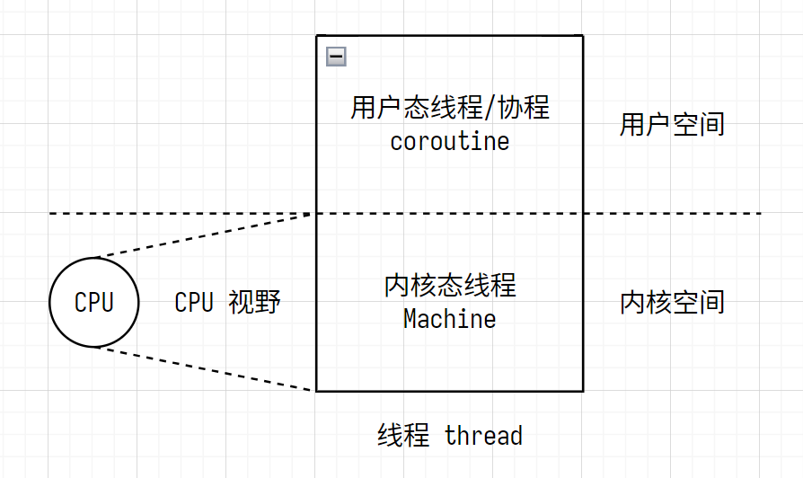

# GMP: Goroutine, Machine, Processor

协程调度器

- 单进程不需要调度器，进程串行运行
- 多线程需要调度器，例：时间片轮转线程调度算法
  - 线程很多 -> 内存占用很大
  - 频繁的线程调度 -> cpu 开销很大

1. 一个线程 thread 分为内核态线程 machine 和用户态线程/协程 coroutine
2. 一个协程 coroutine 必须绑定一个 内核态线程 machine
3. M 个协程 coroutine 可以通过**协程调度器**绑定 N (M >> N) 个内核态线程 machine
4. 一个线程 thread 几 MB，一个协程 coroutine 几 KB

## GMP

- G: goroutine 协程
- P: processor GOMAXPROCS 个协程调度器
- M: machine 内核态线程
