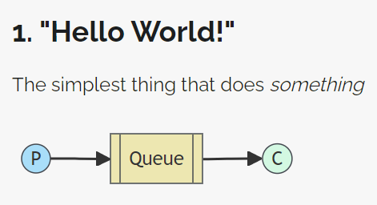
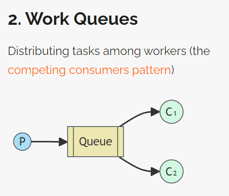
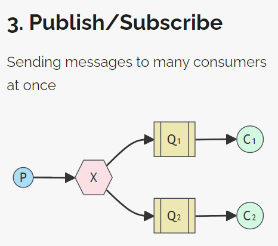

# RabbitMQ


## 查看端口映射的命令

```shell
sudo netstat -tunlp

sudo ss -tunlp
```

## Hello World 简单

简单模型：一个生产者，一个消费者，一条消息单播给一个消息者



## Work Queues 工作队列

工作队列模型：一个生产者，n 个消费者，一条消息单播给一个消息者

- 1 个负责发布的 new_task 线程
- 3 个负责订阅的 worker 线程



**轮询调度** Round-robin dispatching

平均的，每个 worker 线程收到相同数量的消息

**消息确认** Message acknowledgement

RabbitMQ 支持消息确认。消费者收到一条消息，返回确认 ack，通知 RabbitMQ 该消息已被处理，可以删除该消息。如果消费者死亡（连接关闭、通道关闭等），未返回确认
ack，RabbitMQ 判断该消息未被处理，重新发送该消息给其他消费者，确保消息不丢失。默认自动返回确认 `autoAck: true`

手动返回确认

```go
msg.Ack(false /* multiple */) // 只确认一次
```

**消息持久性** Message durability

消息确认确保了即使消费者死亡，消息 msg 也不会丢失。但如果 RabbitMQ 服务器停止，例如 `docker stop rabbit`，消息 msg 仍会丢失。

持久的 `durable: true` 当 RabbitMQ 退出 quit 或崩溃 crush 时，RabbitMQ 会丢失队列 queue 和消息 msg。将队列 queue 和 消息 msg 都标记为持久的 durable/persistent，以确保消息不丢失

持久的队列

```go
queue, err := ch.QueueDeclare(
    "task_queue", // name
    true,  // durable 持久的队列
    false, // delete when unused
    false, // exclusive
    false, // no-wait
    nil,   // argument
)
```

持久的消息

```go
amqp.Publishing{
    DeliveryMode: amqp.Persistent, // 持久的消息
    ContentType:  "text/plain",
    Body:         []byte(body),
},
```

RabbitMQ 可能只缓存，未写入磁盘，不完全保证持久性

**公平调度** Fair dispatch

将 prefetch count 预取计数设置为 1。告诉 RabbitMQ 不要一次性发送多条消息给 worker
工作线程（工作线程处理并确认当前消息前，不要发送新的消息给该工作线程）而是发送新的消息给空闲线程

```go
err = ch.Qos( // 服务质量 Quality of Service
    1,        // prefetch count
    0,        // prefetch size
    false,    // global
)
```

## Publish Subscribe 发布/订阅

一个生产者，n 个消费者，一条消息多播/广播给多个消费者（发布/订阅）

1. 生产者是发送消息的线程
2. 队列是缓存消息的缓冲区
3. 消费者是接收消息的线程

对比工作队列模型，多了一个交换机 exchange 交换机从发布者接收消息，向（多个）订阅者发送消息。如何处理消息、是否绑定 bind（或附加 append）到某个队列或多个队列，由交换机的类型 direct, topic, headers, fanout 决定



创建一个 fanout 扇出（广播）交换机

扇出交换机将收到的所有消息广播到所有队列

**临时队列** Temporary queues

不指定队列名（传递空字符串）时，创建一个随机名、非持久 non-durable 队列

独占的 `exclusive: false` 表示，声明队列 queue 的连接 conn 关闭时，该队列将被删除

```go
conn, err := amqp.Dial(url)
ch, err := conn.Channel()
queue, err := ch.QueueDeclare(...)
```
