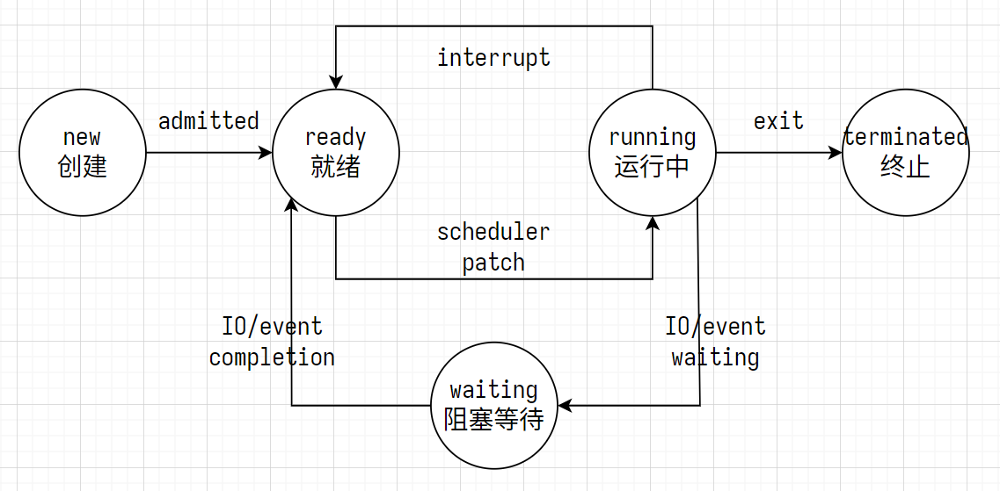
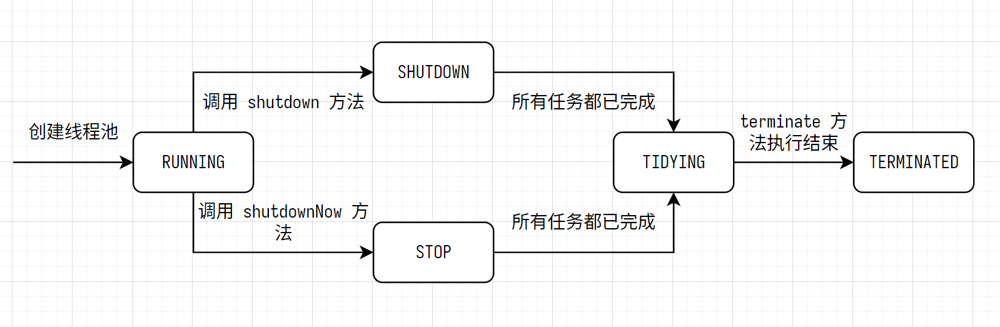

# Java 并发编程

## 创建线程的 3 种方式

**创建一个类，继承 Thread 类，重写 run 方法**

```java
// ! 创建一个类，继承 Thread 类，重写 run 方法
class ThreadExt extends Thread {

  @Override
  public void run() {
    for (int i = 0; i < 10; i++) {
      System.out.println(Thread.currentThread().getName() + ", i = " + i);
    }
  }
}
```

测试

```java

@Test // ! mvn -Dtest=ThreadTest#testThread1 test --quiet
public void testThread1() {
  var thread = new ThreadExt();
  thread.setName("thread1");
  thread.start();
}
```

**创建一个类，实现 Runnable 接口，重写 run 方法**

```java
// ! 创建一个类，实现 Runnable 接口，重写 run 方法
class RunnableImpl implements Runnable {

  @Override
  public void run() {
    for (int i = 0; i < 10; i++) {
      try {
        Thread.sleep(1000 /* ms */);
      } catch (InterruptedException ignored) {
      }
      System.out.println(Thread.currentThread().getName() + ", i = " + i);
    }
  }
}
```

测试

```java

@Test // ! mvn -Dtest=ThreadTest#testThread2 test -q
public void testThread2() {
  var task = new RunnableImpl();
  Thread thread = new Thread(task, "thread2");
  thread.start();
}
```

**创建一个类，实现 Callable 接口，重写 call 方法**

```java
// ! 创建一个类，实现 Callable 接口，重写 call 方法
class CallableImpl implements Callable<String> {

  @Override
  public String call() throws Exception {
    Thread.sleep(3000);
    return "Honkai: Star Rail";
  }
}
```

测试

```java

@Test // ! mvn -Dtest=ThreadTest#testThread3 test -q
public void testThread3() {
  // 创建异步任务 FutureTask
  var futureTask = new FutureTask<>(new CallableImpl());
  // 启动线程
  new Thread(futureTask).start();
  try {
    // 等待异步任务结束，获取异步任务 futureTask 的执行结果
    String retVal = futureTask.get();
    System.out.println(retVal);
  } catch (Exception ignored) {
  }
}
```

Future 对象：获取异步任务的结果等

```java
package java.util.concurrent;

interface Future<V> {
  // 取消异步任务
  boolean cancel(boolean mayInterruptIfRunning);
  // 异步任务是否已取消
  boolean isCancelled();
  // 异步任务是否已完成
  boolean isDone();
  // 获取任务的执行结果
  V get() throws InterruptedException, ExecutionException;
  // 指定超时时间，获取任务的执行结果。超时时间到时，返回 null
  V get(long timeout, TimeUnit unit) throws InterruptedException, ExecutionException, TimeoutException;
}

class FutureTask implements Future {
}
```

## 线程状态



```java
// BLOCKED                不会释放已获得的锁
// WAITING, TIMED_WAITING 会释放已获得的锁
public enum State {
  NEW,             /* 线程被创建，未启动(运行）          */
  RUNNABLE,        /* 线程可运行：包括就绪、运行中       */
  BLOCKED,         /* 线程获取锁失败，被动阻塞           */
  WAITING,         /* 线程主动无限等待，需要其他线程唤醒 */
  // 线程调用
  // - Object.wait();
  // - Thread.join();
  // - LockSupport.park();
  // 主动无限等待，需要其他线程唤醒
  TIMED_WAITING,   /* 线程主动有限等待，时间后自动唤醒   */
  // 线程调用
  // - Thread.sleep(long millis);
  // - Object.wait(long timeout);
  // - LockSupport.parkNanos(long nanos);
  // - Thread.join(long millis);
  // - LockSupport.parkUntil(long deadline);
  // 主动有限等待，超时后自动唤醒
  TERMINATED       /* 线程终止，资源被回收               */
}
```

## 线程中断

```java
// 将调用者线程的中断标志设置为 true
// 例 t1.interrupt(); 将 t1 的中断标志设置为 true
public void interrupt();
// 当前线程的中断标志是否为 true
public static boolean isInterrupted();
// 获取当前线程的中断标志，并重置为 false
public static boolean interrupted() {
  return currentThread().getAndClearInterrupt();
}
```

## 线程的优先级

- Linux 中，线程优先级 [-20, 19] 一共 40 个优先级，数值越小优先级越高
- Java 中，线程优先级 [1, 10] 一共 10 个优先级，数值越大优先级越高，默认为 5
- Java 中，线程优先级越高，获得 cpu 时间片（被调度）的概率越高

## 并发安全问题

- 有序性：使用 volatile 或内存屏障禁止指令重排序
- 原子性：一个或多个操作要么全部执行成功，要么全部不执行
- 可见性：一个线程修改一个共享变量后，其他线程立刻可见
- 活跃性：线程有正常的生命周期和状态转换，没有死锁、活锁、饥饿等并发安全问题

## volatile 关键字

- volatile 禁止指令重排序
- volatile 可以保证有序性、可见性，不能保证原子性

## synchronized 关键字

- synchronized 等价于对一个方法或代码块加互斥锁
- synchronized 可以保证原子性，使用内存屏障保证可见性、有序性

使用 synchronized

1. 同步方法，使用当前对象 this 作为互斥锁
2. 同步静态方法，使用类的 Class 对象作为互斥锁
3. 同步代码块，可以使用任意对象作为互斥锁

- synchronized 是可重入锁
- synchronized 是悲观锁

## 锁的分类

- 悲观锁：悲观的假设有数据竞争，数据读写前加锁，适合写多读少的场景
  - synchronized 互斥锁
  - Lock 接口的实现类
- 乐观锁：乐观的假设没有数据竞争，数据读写前不加锁，适合读多写少的场景

  - Atomic 等原子类

- 自旋锁 Spin Lock: 线程获取锁失败时，不放弃 cpu，循环检查锁是否被释放（线程忙等待）
- 非自旋锁：线程获取锁失败时，放弃 cpu，阻塞直到锁被释放，或被唤醒，例如 object.notify();

- 公平锁：先申请锁的线程先获得锁
- 非公平锁：后申请锁的线程可能先获得锁

```java
import java.util.concurrent.locks.ReentrantLock;
// ReentrantLock 默认非公平锁
ReentrantLock lock = new ReentrantLock();
// 指定 ReentrantLock 公平锁
ReentrantLock lock = new ReentrantLock(true /* fair */);
```

- 可重入锁 Reentrant Lock: 一个线程获取锁后，该线程再次获取该锁时不会被阻塞，可以重复加锁
  - synchronized 互斥锁
  - ReentrantLock 可重入锁
- 非可重入锁：一个线程获取锁后，该线程再次获取该锁时会被阻塞，不可以重复加锁

- 共享锁：多个线程共享的锁
  - ReentrantReadWriteLock 的共享读锁
- 排他锁：一个线程独占的锁
  - synchronized 互斥锁
  - ReentrantReadWriteLock 的排他写锁

## ReentrantLock 可重入锁

1. 默认非公平锁
2. 一个线程获取锁后，该线程再次获取该锁时不会被阻塞，可以重复加锁
3. 加锁 n 次、解锁 n 次可重入锁才被释放
4. 可重入锁必须在 finally 块中解锁，以保证解锁

## ReentrantReadWriteLock 可重入读写锁

1. 默认非公平锁
2. 包括共享读锁 Shared Read Lock 和独占写锁 Unique Write Lock
3. 一个线程获取读锁后，该线程再次获取读锁时不会被阻塞，可以重复加读锁
4. 一个线程获取写锁后，该线程再次获取写锁时不会被阻塞，可以重复加写锁
5. 一个线程获取写锁后，该线程可以继续获取写锁

## Condition 条件变量

Condition 接口提供的方法

```java
import java.util.concurrent.locks.Condition;

// 线程条件等待，直到被唤醒、被中断，类似于 object.wait();
// - 被唤醒 object.notify(); object.notifyAll(); condition.signal(); condition.signalAll();
// - 被中断 t.interrupt();
void await() throws InterruptedException;

// 线程条件等待，直到被唤醒，不可被中断
void awaitUninterruptibly();

// 线程条件等待，等待指定的时间，或被唤醒、被中断
long awaitNanos(long nanosTimeout) throws InterruptedException;

// 线程条件等待，等待指定的时间，或被唤醒、被中断
// 类似于 object.wait(long timeout); object.wait(long timeout, int nanos);
boolean await(long time, TimeUnit unit) throws InterruptedException;

// 线程条件等待，直到截至日期，或被唤醒、被中断
boolean awaitUntil(Date deadline) throws InterruptedException;

// 随机唤醒一个等待中的线程，类似于 object.notify();
void signal();

// 唤醒所有等待中的线程，类似于 object.notifyAll();
void signalAll();
```

Object 类的主要方法

```java
// 线程等待，直到被唤醒、被中断，类似于 condition.await();
void wait();

// 线程等待指定的时间，或被唤醒、被中断，类似 object.await(long time, TimeUnit unit)
void wait(long timeout);

// 线程等待指定的时间，或被唤醒、被中断，类似 object.await(long time, TimeUnit unit)
void wait(long timeout, int nanos);

// 随机唤醒一个等待中的线程，类似于 condition.signal();
void notify();

// 唤醒所有等待中的线程，类似于 condition.signalAll();
void notifyAll();
```

## LockSupport 主动等待和被动唤醒

```java
// 当前线程主动等待
// 直到其他线程调用 unpark 方法，或线程被中断（被动唤醒）
void park();
 // 传递一个 blocker 对象，方便排查并发安全问题
void park(Object blocker);

// 当前线程主动等待
// 线程等待指定的时间，或直到其他线程调用 unpark 方法，或线程被中断（被动唤醒）
void parkNanos(long nanos);
// 传递一个 blocker 对象，方便排查并发安全问题
void parkNanos(Object blocker, long nanos);

// 当前线程主动等待
// 直到截至日期，或直到其他线程调用 unpark 方法，或线程被中断（被动唤醒）
void parkUntil(long deadline);
// 传递一个 blocker 对象，方便排查并发安全问题
void parkNanos(Object blocker, long nanos);
```

## Dump 线程

Dump 线程指获取线程快照，包括

- 线程名、线程 id
- 线程状态：可运行 runnable、等待 waiting、睡眠 timed_waiting、阻塞 blocked
- （方法）调用堆栈
- 锁信息：持有的锁、等待的锁

## 原子操作

**原子基本类型**

- AtomicBoolean 原子布尔类型
- AtomicInteger 原子整型
- AtomicLong 原子长整型

```java
int initInt = 0;
AtomicInteger atomicInt = new AtomicInteger(initInt); // 初始化为 0
// 对应的非原子操作
// add -> initInt += delta;
// get -> var _ = initInt;
atomicInt.addAndGet(int delta);

// 对应的非原子操作
// increment -> initInt += 1;
// get       -> var _ = initInt;
atomicInt.incrementAndGet();

// 对应的非原子操作
// get -> var oldValue = initInt;
// set -> initInt = newValue;
atomicInt.getAndSet(int newValue);

// 对应的非原子操作
// get       -> var oldValue = initInt;
// increment -> initInt += 1;
atomicInt.getAndIncrement();
```

**原子数组类型**

- AtomicIntegerArray 原子整型数组
- AtomicLongArray 原子长整型数组
- AtomicReferenceArray 原子引用类型数组

```java
int[] initArr = new int[]{1, 2, 3};
AtomicIntegerArray atomicIntArr = new AtomicIntegerArray(initArr);

// 对应的非原子操作
// add -> initArr[i] += delta;
// get -> var _ = initArr[i];
atomicIntArr.addAndGet(int i, int delta);

// 对应的非原子操作
// get       -> var _ = initArr[i];
// increment -> initArr[i] += 1;
atomicIntArr.getAndIncrement(int i);

// 对应的非原子操作
// if (initArr[i] == except) { // compare
//   initArr[i] = update;      // set
// } else {
//   // do nothing...
// }
atomicIntArr.compareAndSet(int i, int except, int update);
```

**其他**

- AtomicReference 原子引用
- AtomicIntegerFieldUpdater 原子更新器，更新引用对象的 volatile 修饰的整型字段
- AtomicLongFieldUpdater 原子更新器，更新引用对象的 volatile 修饰的长整型字段
- AtomicStampedReference 带版本号的原子引用

## 线程池

线程池的 5 种状态



## 并发工具类

| 并发工具类     | 说明                     |
| -------------- |------------------------|
| Semaphore      | 限制线程数                  |
| Exchanger      | 线程间交换数据                |
| CountDownLatch | 类似 golang 的 WaitGroup  |
| CyclicBarrier  | 可以循环使用的 CountDownLatch |
| Phaser         | 增强的 CyclicBarrier      |
