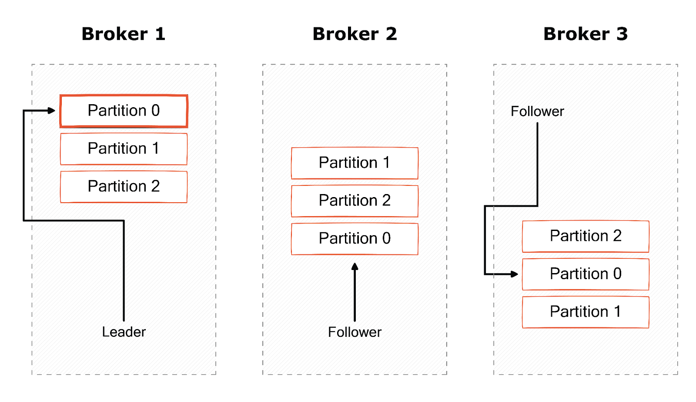

# Kafka

> 荣花与炎日之途

Docker

```shell
# 删除容器和数据卷
docker-compose down -v # volume
# 以 detach 分离模式运行容器
docker-compose up -d # detach
# 进入容器
# -it 表示打开一个 interactive tty 交互式终端
docker exec -it kafka_container /bin/bash
```

### 快速开始

- 主题类比目录，分区类比子目录，事件类比文件

| Keywords       |                                               |
| -------------- | --------------------------------------------- |
| Kafka          | 分布式的事件流平台                            |
| 事件 Event     | 一个键值对，也称为记录 Record 或消息 Message  |
| 代理 Broker    | 负责读写、持久化存储和复制消息的 Kafka 服务器 |
| 主题 Topic     | 事件的逻辑分组，主题是分区的集合              |
| 分区 Partition | 一个主题有一个或多个分区，分区等价于消息队列  |
| 偏移量 Offset  | 消费进度                                      |
| 生产者         | 发布某主题的消息                              |
| 消费者         | 订阅某主题，消费生产者发布的消息              |
| 消费者组       | 订阅同一个主题的消费者的集合，以实现高吞吐    |

1. 分区 (Partition) 分布在 Kafka 集群的多个代理服务器上
2. 分区（消息队列）是 FIFO 的
3. 按事件的键分区，即同一个键的事件会被写入同一个分区
4. 对于某个分区，代理 (Broker) 分为领导者 (Leader) 和追随者 (Followers)
   - 领导者处理分区的读写
   - 追随者复制领导者的分区，追随者的副本与领导者的分区保持数据同步
   - 复制因子 (Replication Factor) 决定副本的数量
   - 领导者故障时，追随者可以被选举为新的领导者，以实现高可用
5. 消费者组的某个组成员故障时，其他组成员可以接管 TA 的分区
6. 分区数量有助于确定消费者组的最大成员数量，例如主题有 5 个分组时，消费者组最多有 5 个成员。如果加入第 6 个成员，则第 6 个成员将空闲
7. Zookeeper 负责跟踪
   - 哪些代理属于 Kafka 集群
   - 对于某个分区，哪个代理是该分区的领导者
   - 主题的配置：分区数量、副本位置、消费者组
   - 访问控制列表 (Access Control Lists): 客户端是否可以创建、删除主题，是否可以生产、消费某个主题的消息等

 图中的复制因子为 3

```shell
cd /
find . -name "kafka-topics.sh"
cd /opt/bitnami/kafka/bin
# 创建一个主题 topic
# bootstrap 引导
kafka-topics.sh --create --topic quickstart-events --bootstrap-server localhost:9092
# 打印主题 topic 的描述信息
kafka-topics.sh --describe --topic quickstart-events --bootstrap-server localhost:9092
# 生产者：将一些事件（记录或消息，即字符串）写入主题
# 默认一行一个事件
kafka-console-producer.sh --topic quickstart-events --bootstrap-server localhost:9092
>This is my first event
>This is my second event
# 消费者：读出这些事件
kafka-console-consumer.sh --topic quickstart-events --from-beginning --bootstrap-server localhost:9092
```

查看连接的客户端

```shell
kafka-consumer-groups.sh --bootstrap-server localhost:9092
```

### Producer-Consumer API
